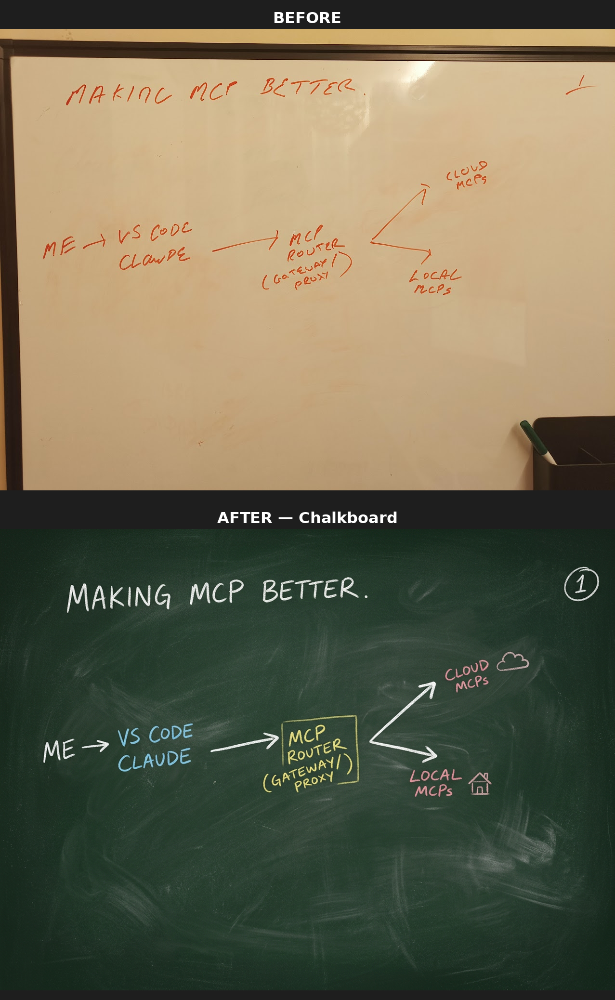
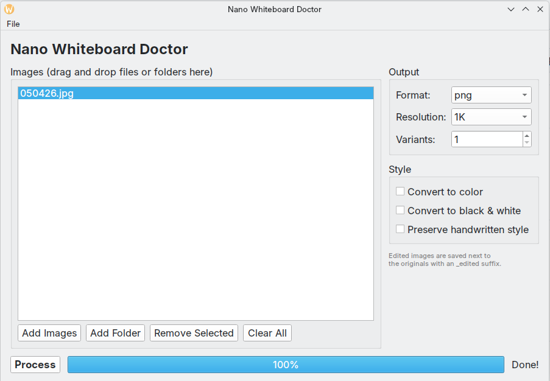

# Whiteboard Makeover

A desktop GUI tool that transforms messy whiteboard photos into clean, polished graphics using [Fal AI's Nano Banana 2](https://fal.ai/models/fal-ai/nano-banana-2/edit) image-to-image model.


## Before & After

### Chalkboard Style


### Blueprint Style


### Pixel Art Style


### Neon Sign Style


### Corporate Clean Style


More samples available in the [Sample-Whiteboards](https://github.com/danielrosehill/Sample-Whiteboards) companion repo.

## What It Does

Take a photo of your messy whiteboard and Whiteboard Makeover will:
- Clean up handwriting and sketches
- Add polished labels and icons
- Produce a professional-looking diagram
- Apply any of **24 built-in style presets** or a fully custom prompt

Supports **single image** or **batch processing** of multiple whiteboard photos at once.

## Features

- **24 style presets** across 5 categories (Professional, Creative, Technical, Retro & Fun, Language)
- **Word dictionary** -- double-click any input image to add terms the AI should spell correctly
- **Click-to-enlarge** result thumbnails with full-size viewer
- **Send back for touchups** -- re-process from the enlarged view (creates versioned outputs)
- **Animated processing indicator** so you know it's working
- **Drag-and-drop** images or folders (Wayland-compatible)
- **CLI mode** for batch processing from the terminal
- **Help page** (Help > How to Use) documenting all features

## Screenshot



## Style Presets

24 presets across 5 categories. Each preset applies a distinct visual treatment while preserving all original whiteboard content.

### Professional

| Preset | Description |
|--------|-------------|
| Clean & Polished | Clear labels and icons on a white background -- the default |
| Corporate Clean | Minimalist corporate slide-ready diagram |
| Hand-Drawn Polished | Refined sketch -- designer's notebook feel |
| Minimalist Mono | Black and white, Bauhaus-inspired minimalism |
| Ultra Sleek | Thin lines, Swiss design aesthetic |
| Blog Hero | Gradient background, 16:9 blog featured image |

### Creative

| Preset | Description |
|--------|-------------|
| Colorful Infographic | Bold, vibrant infographic with rich colors |
| Comic Book | Graphic novel panel with ink outlines and Ben-Day dots |
| Isometric 3D | Isometric 3D-style boxes and depth |
| Neon Sign | Glowing neon tubes on a dark brick wall |
| Pastel Kawaii | Soft pastel palette with cute rounded forms |
| Pixel Art | Retro 16-bit pixel art style |
| Stained Glass | Cathedral stained glass with jewel tones |
| Sticky Notes | Colorful sticky notes on a cork board |
| Watercolor Artistic | Watercolor painting on textured paper |

### Technical

| Preset | Description |
|--------|-------------|
| Blueprint | Architectural blueprint on deep blue background |
| Dark Mode Technical | Engineering diagram on dark background |
| Flat Material | Google Material Design flat UI style |
| GitHub README | Markdown-friendly, repo architecture overview |
| Photographic 3D | Photorealistic 3D render with glass and metal |
| Terminal Hacker | Green-on-black phosphor CRT terminal |
| Visionary Inspirational | Cosmic/futurist keynote aesthetic |

### Retro & Fun

| Preset | Description |
|--------|-------------|
| Chalkboard | Classic green chalkboard with chalk texture |
| Eccentric Psychedelic | Wild psychedelic maximum saturation |
| Mad Genius | Chaotic beautiful-mind inventor's notebook |
| Retro 80s Synthwave | Neon 1980s synthwave with grid lines |
| Woodcut | Medieval woodcut/linocut print on parchment |

### Language

| Preset | Description |
|--------|-------------|
| Bilingual Hebrew | English + Hebrew labels side by side |
| Translated Hebrew | Fully translated to Hebrew with RTL layout |

## Install

### Option A: Debian package (.deb)

Download the `.deb` from [Releases](https://github.com/danielrosehill/Nano-Whiteboard-Doctor/releases) and install:

```bash
sudo dpkg -i whiteboard-makeover_0.2.0_all.deb
whiteboard-makeover
```

### Option B: Run from source with uv

```bash
git clone https://github.com/danielrosehill/Nano-Whiteboard-Doctor.git
cd Nano-Whiteboard-Doctor
uv sync
uv run whiteboard-makeover
```

### Get a Fal AI API key

Sign up at [fal.ai](https://fal.ai) and grab your API key from the dashboard. On first run, you'll be prompted to enter it. The key is saved locally in `~/.config/whiteboard-makeover/config.json`.

## Usage

1. Click **Add Images** or drag and drop whiteboard photos
2. (Optional) **Double-click** an image to add a word dictionary for tricky terms
3. Choose a **Style Preset** from the dropdown (or write a custom prompt)
4. (Optional) Adjust output format, resolution, and aspect ratio
5. Click **Process** -- an animated indicator shows progress
6. **Click any result thumbnail** to view it full-size
7. From the enlarged view, click **Send Back for Touchups** to re-process

## Configuration

- **API Key**: Stored in `~/.config/whiteboard-makeover/config.json`
- **Output Format**: PNG (default), JPEG, or WebP
- **Resolution**: 0.5K, 1K (default), 2K, or 4K
- **Aspect Ratio**: Auto (default), 1:1, 4:3, 16:9, and more

Existing config from `~/.config/nano-whiteboard-doctor/` is automatically migrated on first run.

## Building the .deb

```bash
./build-deb.sh
```

Requires `uv`, `dpkg-deb`, and `fakeroot`.

## License

MIT
